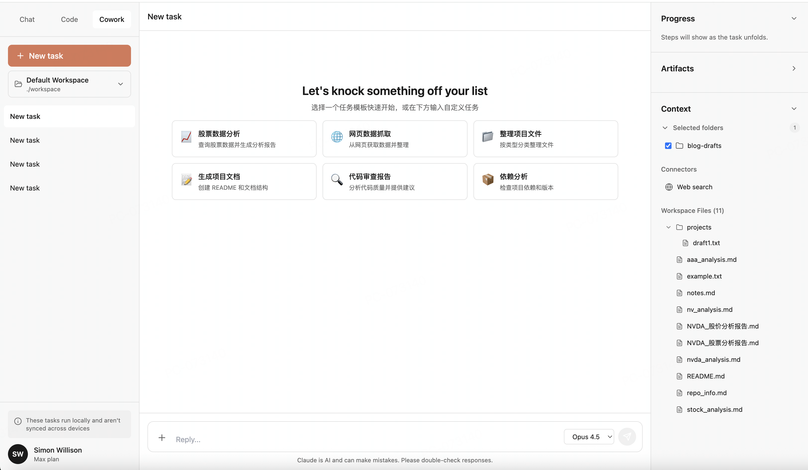
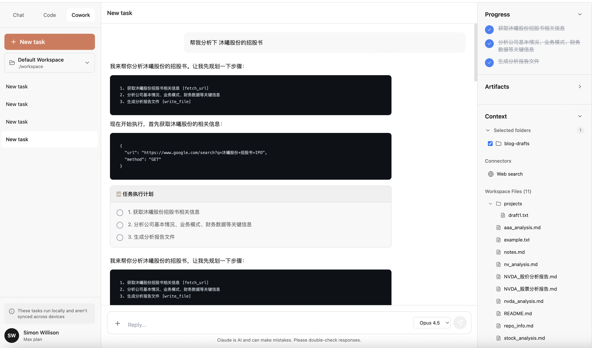
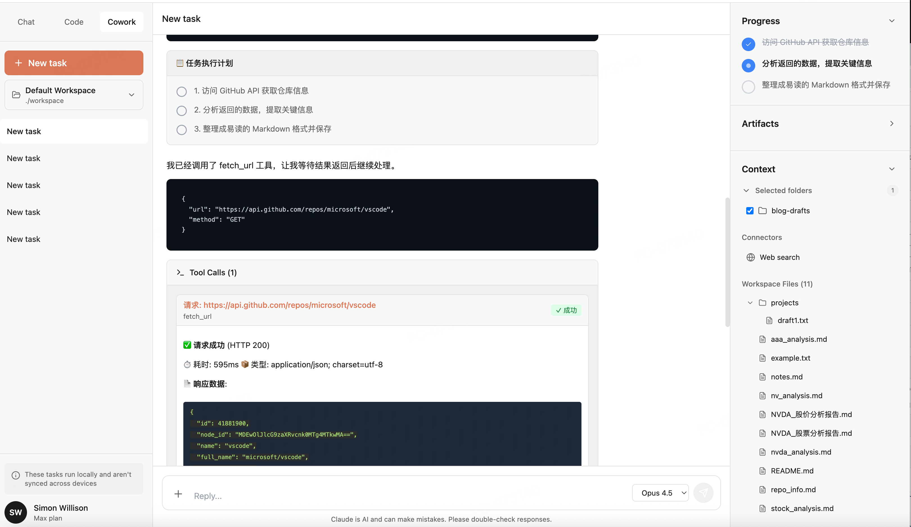
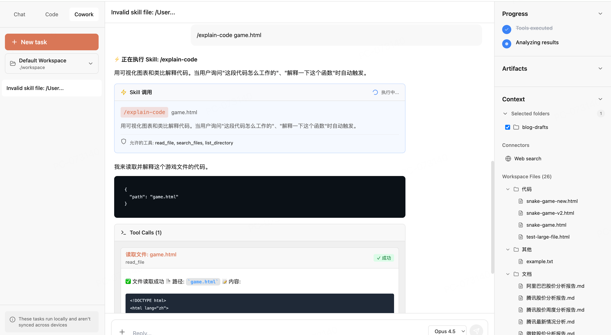

# Cowork - AI 协作开发助手

一个功能完整的 AI 协作开发平台，支持任务规划、工具调用、文件操作和网络请求。基于 Next.js 14、TypeScript 和 Tailwind CSS 构建。

> 🤖 **AI 模型配置**  
> 查看 [快速配置指南 (3分钟)](./docs/QUICK_AI_SETUP.md) 或 [详细文档索引](./docs/INDEX.md)
> 
> 📚 **在线文档**: 访问 [http://localhost:3000/docs](http://localhost:3000/docs) 查看所有文档
>
> 🎯 **功能特性**: 查看 [FEATURES.md](./docs/FEATURES.md) 了解详细功能说明

## 📸 产品演示

### 主界面总览
完整的三栏布局设计，左侧任务管理、中间对话区、右侧进度跟踪。



### 智能任务规划
AI 自动将复杂任务拆分为多个步骤，并为每个步骤指定所需工具。



### 工具调用执行
支持文件系统操作、网络请求等多种工具，实时显示执行过程和结果。



### Skills 系统
通过斜杠命令调用预定义的 Skill，AI 按照 Skill 指令执行任务。



## ✨ 核心特性

### 🖥️ 桌面应用支持
- **跨平台桌面应用**: 支持 macOS、Windows、Linux
- **原生体验**: 标准窗口控制、应用菜单、键盘快捷键
- **启动配置**: 首次启动时配置工作区和 API Key
- **独立工作区**: 数据存储在系统用户目录
- **开发模式**: 支持热重载和 DevTools
- **一键打包**: 构建为 DMG、NSIS、AppImage 等格式

### 🎯 任务规划系统
- **智能任务拆分**: AI 自动将复杂任务拆分为多个步骤
- **可视化进度**: 实时显示任务执行进度和状态
- **步骤管理**: 支持 pending、in_progress、completed、failed 状态
- **工具指定**: 为每个步骤指定需要使用的工具
- **错误处理**: 步骤失败时自动停止并显示错误

### 🛠️ 工具调用系统
- **文件系统工具**: 读取、写入、列表、搜索、删除、移动文件
- **网络请求工具**: 支持 GET、POST 等 HTTP 请求
- **模块化设计**: 每个工具独立维护，易于扩展
- **JSON 解析器**: 多策略容错，自动修复常见 JSON 错误
- **强制工具调用**: 双层提示机制确保 AI 正确生成工具调用

### 📊 进度可视化
- **垂直列表显示**: 清晰展示所有任务步骤
- **实时状态更新**: 步骤状态实时同步
- **视觉反馈**: 完成、进行中、待执行的不同状态显示
- **脉动动画**: 当前执行步骤的动态提示

### 🚀 快速任务模板
- **8 个预制模板**: 涵盖数据分析、文件操作、代码分析、自动化
- **最佳实践**: 每个模板包含详细的步骤拆分和工具使用建议
- **一键启动**: 点击模板自动填充 prompt

### 📁 文件系统集成
- **目录树展示**: 完整的 workspace 目录结构
- **可折叠目录**: 支持展开/收起子目录
- **无数量限制**: 显示所有文件
- **实时加载**: 自动读取 workspace 内容

### 🌐 网络请求功能
- **HTTP 请求**: 支持多种请求方法
- **数据抓取**: 获取外部 API 数据
- **智能分析**: AI 自动分析和总结响应数据
- **元信息展示**: 显示状态码、耗时、内容类型

### 📦 Artifacts 管理
- **自动收集**: 文件写入后自动添加到 Artifacts
- **文件列表**: 显示所有生成的文件
- **时间记录**: 记录文件创建时间

### UI/UX Features

- Modern, clean interface matching Claude's design language
- Responsive layout with three-panel design
- Smooth animations and transitions
- Auto-resizing message input
- Keyboard shortcuts (Enter to send, Shift+Enter for new line)
- Task persistence and switching
- Type-safe with TypeScript
- Optimized performance with React hooks

## 🔧 技术栈

- **前端框架**: Next.js 14 (App Router)
- **开发语言**: TypeScript
- **样式方案**: Tailwind CSS
- **图标库**: Lucide React
- **状态管理**: React Hooks
- **AI 服务**: DeepSeek API
- **文件系统**: Node.js fs/promises
- **网络请求**: Fetch API

## 📂 项目结构

```
cowork/
├── app/
│   ├── api/                    # API 路由
│   │   ├── filesystem/         # 文件系统 API
│   │   └── web/                # 网络请求 API
│   ├── globals.css
│   ├── layout.tsx
│   └── page.tsx
├── components/
│   ├── LeftSidebar.tsx         # 任务列表侧边栏
│   ├── ChatArea.tsx            # 聊天界面
│   ├── RightSidebar.tsx        # 进度和上下文面板
│   ├── FileTree.tsx            # 目录树组件
│   ├── TaskPlanDisplay.tsx     # 任务计划展示
│   ├── QuickTaskCards.tsx      # 快速任务卡片
│   └── WorkspaceSelector.tsx   # 工作区选择器
├── hooks/
│   ├── useCowork.ts            # 核心状态管理
│   └── useWorkspaceFiles.ts    # 文件列表加载
├── lib/
│   ├── tools/                  # 工具系统
│   │   ├── filesystem/         # 文件系统工具
│   │   ├── web/                # 网络请求工具
│   │   ├── parser.ts           # JSON 解析器
│   │   ├── registry.ts         # 工具注册中心
│   │   └── types.ts            # 工具类型定义
│   ├── task-planner.ts         # 任务规划器
│   ├── quick-tasks.ts          # 快速任务模板
│   ├── ai-service.ts           # AI 服务封装
│   └── workspace-context.ts    # 工作区上下文
├── types/
│   └── index.ts                # TypeScript 类型定义
├── workspace/                  # 工作区目录
└── docs/                       # 文档目录
    ├── FEATURES.md             # 功能特性文档
    ├── AI_INTEGRATION_GUIDE.md # AI 集成指南
    └── ...
```

## Getting Started

### Installation

1. Navigate to the cowork directory:
   ```bash
   cd /Users/jiangtianyi/Documents/necode/cowork
   ```

2. Install dependencies:
   ```bash
   npm install
   # or
   yarn install
   # or
   pnpm install
   ```

### Running as Web Application

1. Start the development server:
   ```bash
   npm run dev
   # or
   yarn dev
   # or
   pnpm dev
   ```

2. Open your browser and visit:
   ```
   http://localhost:3000
   ```

### Running as Desktop Application

1. Start the desktop app in development mode:
   ```bash
   npm run electron:dev
   ```

2. Build desktop app for your platform:
   ```bash
   # Build for current platform
   npm run electron:build
   
   # Or build for specific platforms
   npm run electron:build:mac    # macOS
   npm run electron:build:win    # Windows
   npm run electron:build:linux  # Linux
   ```

📚 **Desktop guide**: See [ELECTRON.md](./ELECTRON.md) for detailed desktop app documentation.

### Connecting to Real AI Models

By default, the app uses simulated AI responses. To connect to real AI models:

1. **Copy the environment file**:
   ```bash
   cp .env.local.example .env.local
   ```

2. **Add your API key** to `.env.local`:
   ```bash
   NEXT_PUBLIC_OPENAI_API_KEY=sk-your-api-key-here
   NEXT_PUBLIC_USE_REAL_AI=true
   ```

3. **Restart the dev server**:
   ```bash
   npm run dev
   ```

📚 **Detailed guide**: See [AI_SETUP.md](./docs/AI_SETUP.md) for complete configuration instructions.

### 💡 使用方式

#### 1. 快速开始
- 点击左侧 "+ New task" 创建新任务
- 选择快速任务模板或输入自定义任务

#### 2. 使用快速任务模板
```
示例模板：
📈 股票数据分析 - 查询股票数据并生成分析报告
📁 整理项目文件 - 按类型分类整理文件
🔍 代码审查报告 - 分析代码质量并提供建议
```

#### 3. 自定义任务
```
输入示例：
"查询英伟达最近一周的股价并生成分析报告"

AI 会自动规划：
1. 查询英伟达股票数据 [fetch_url]
2. 分析股票走势和关键指标
3. 生成分析报告文件 [write_file]
```

#### 4. 查看执行进度
- 右侧 Progress 面板显示实时进度
- 每个步骤的状态清晰可见
- 完成的步骤会显示删除线

#### 5. 查看生成的文件
- Artifacts 面板自动收集生成的文件
- Workspace Files 显示完整的目录树

## 🎯 使用示例

### 示例 1: 股票数据分析
```
用户: 查询英伟达最近一周的股价并生成分析报告

AI 执行流程:
✓ 查询英伟达股票数据
✓ 分析股票走势和关键指标
✓ 生成分析报告文件

生成文件: nvda_analysis.md
```

### 示例 2: 项目文档生成
```
用户: 帮我创建一个完整的项目文档结构

AI 执行流程:
✓ 生成 README.md
✓ 创建 docs 文件夹
✓ 添加 API 文档模板
✓ 添加贡献指南

生成文件: README.md, docs/API.md, docs/CONTRIBUTING.md
```

### 示例 3: 网页数据抓取
```
用户: 访问 GitHub API 获取仓库信息并整理

AI 执行流程:
✓ 访问 GitHub API
✓ 解析 JSON 数据
✓ 整理成易读格式
✓ 保存为 Markdown 文件

生成文件: repo_info.md
```

## Technical Details

### Architecture

- **Component-Based**: Modular React components for maintainability
- **Type Safety**: Full TypeScript coverage for better DX and fewer bugs
- **Custom Hooks**: `useCowork` hook encapsulates all state logic
- **Server Components**: Leverages Next.js App Router for optimal performance
- **CSS Utility-First**: Tailwind CSS for rapid UI development

### Key Components

1. **LeftSidebar**: Task management and navigation
2. **ChatArea**: Message display and input handling
3. **RightSidebar**: Progress tracking, artifacts, and context
4. **useCowork Hook**: Centralized state management with React hooks

### Browser Compatibility
- Chrome/Edge (latest)
- Firefox (latest)
- Safari (latest)

## Customization

### Styling
Edit `tailwind.config.ts` to customize:
- Color scheme (extend theme colors)
- Spacing and sizing
- Typography
- Animations

### AI Responses
Edit `hooks/useCowork.ts` function `simulateAIResponse()` to add custom response patterns.

### UI Components
Modify components in the `components/` directory to add or remove features.

## ✅ 已实现功能

- [x] **桌面应用**: Electron 跨平台桌面应用支持
- [x] **启动配置**: 工作区和 API Key 配置窗口
- [x] **AI 集成**: DeepSeek API 集成
- [x] **文件系统访问**: 完整的文件读写、移动、删除操作
- [x] **任务规划**: 智能任务拆分和逐步执行
- [x] **工具调用系统**: 模块化工具架构，强制工具调用机制
- [x] **错误处理**: 步骤失败时自动停止并显示错误
- [x] **网络请求**: HTTP 请求和数据抓取
- [x] **进度可视化**: 实时进度跟踪，支持失败状态
- [x] **Artifacts 管理**: 自动收集生成的文件
- [x] **目录树展示**: 完整的 workspace 文件结构
- [x] **快速任务模板**: 8 个预制任务模板
- [x] **Markdown 渲染**: 消息内容支持 Markdown
- [x] **代码高亮**: 代码块语法高亮
- [x] **JSON 解析增强**: 多策略容错，处理未转义字符
- [x] **Skills 系统**: 可扩展的 AI 能力系统，支持自定义 Skill

## 🚀 未来规划

- [ ] 任务持久化存储（IndexedDB）
- [ ] 多用户协作功能
- [ ] 移动端响应式设计
- [ ] 深色模式支持
- [ ] 任务导出/导入
- [ ] 更多工具集成（数据库、Git 等）
- [x] ~~插件系统~~ → Skills 系统已实现
- [ ] 性能优化和缓存

## Security Considerations

This is a demo implementation. For production use:

- Implement proper authentication
- Sanitize all user inputs
- Use Content Security Policy (CSP)
- Implement rate limiting
- Sandbox command execution
- Validate file operations
- Add prompt injection defenses

## 📚 文档

- [功能特性文档](./docs/FEATURES.md) - 详细的功能说明
- [AI 集成指南](./docs/AI_INTEGRATION_GUIDE.md) - AI 模型配置
- [快速配置指南](./docs/QUICK_AI_SETUP.md) - 3 分钟快速开始
- [工具开发指南](./docs/AI_TOOLS_GUIDE.md) - 如何开发新工具
- [文件系统快速开始](./docs/FILESYSTEM_QUICKSTART.md) - 文件操作指南
- [网络访问指南](./docs/WEB_ACCESS_GUIDE.md) - 网络请求使用
- [Skills 系统指南](./docs/SKILLS_GUIDE.md) - 创建和使用 Skills
- [文档索引](./docs/INDEX.md) - 所有文档列表

## 📝 更新日志

### 2025-01-16
- ✨ 实现任务规划系统
- ✨ 重构 JSON 解析器（多策略容错）
- ✨ 添加快速任务模板（8 个预制模板）
- ✨ Progress 改为垂直列表显示
- ✨ Artifacts 自动收集
- ✨ Working Files 改为目录树展示
- 🐛 修复文件路径显示问题
- 🐛 修复 JSON 解析错误
- 📚 添加完整的功能文档

## 🔗 参考资料

- [Claude Cowork Announcement](https://claude.com/blog/cowork-research-preview)
- [Simon Willison's First Impressions](https://simonwillison.net/2026/Jan/12/claude-cowork/)
- [Anthropic Documentation](https://docs.anthropic.com/)
- [DeepSeek API](https://platform.deepseek.com/)

## 📄 License

MIT License - Feel free to use and modify for your projects.

## 👨‍💻 Contributing

欢迎贡献代码！请查看 [CONTRIBUTING.md](./docs/CONTRIBUTING.md) 了解贡献指南。

## 🙏 Acknowledgments

灵感来源于 Anthropic 的 Claude Cowork，致力于打造一个功能完整的 AI 协作开发平台。
